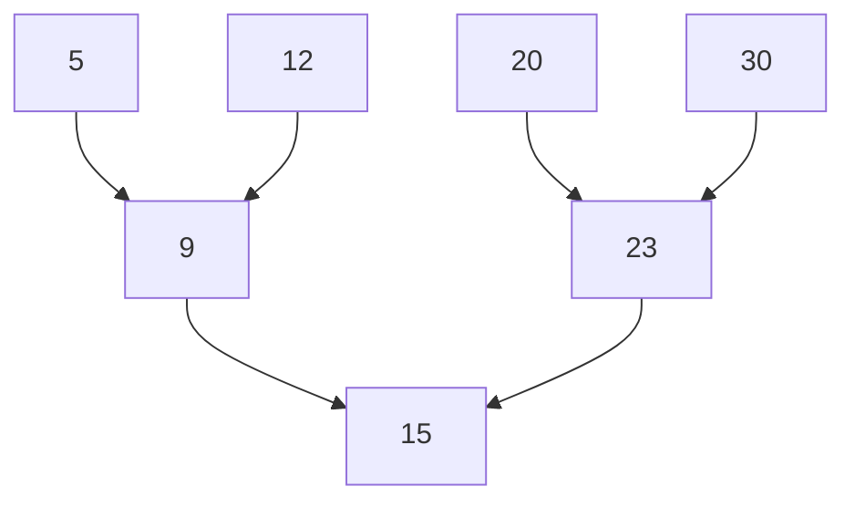
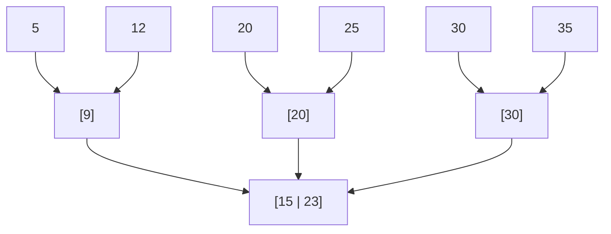

---
{"dg-publish":true,"permalink":"/tomas-statnice/databaze-a-web/datovy-management/zaklady-indexovani/hiearchicke-indexy/","tags":["tomas","datovy_management","databaze_a_web"],"noteIcon":""}
---

> [!NOTE] ChatGPT
> Vygenerováno pomocí ChatGPT na základě přednášek od Holubove

> [!Danger] Stromy
> Stromy jsou vygenerovane a mohou byt spatne, jeste jsem je neupravil.

# Hierarchické Indexy

**Hierarchické indexy** jsou klíčovým prvkem v databázových systémech, které umožňují efektivní vyhledávání a správu dat. V této části se zaměříme na principy hierarchických indexů, vysvětlíme strukturu B-stromu, a popíšeme jeho modifikace, jako jsou B+ strom a B* strom.
## K čemu slouží hierarchické indexy?
Hierarchické indexy slouží k efektivní organizaci a vyhledávání záznamů v databázích. Na rozdíl od hashování, které umožňuje rychlé vyhledávání podle klíče, ale neumožňuje efektivní rozsahové dotazy, hierarchické indexy, jako jsou stromy, umožňují vyhledávání záznamů podle rozsahů klíčů.

## Výhody hierarchických indexů
- **Efektivní vyhledávání:** Stromové struktury umožňují efektivní vyhledávání záznamů, včetně rozsahových dotazů.
- **Dynamické přizpůsobení:** B-stromy a jejich varianty se automaticky přizpůsobují při vkládání a mazání záznamů, což zajišťuje, že strom zůstane vyvážený.
- **Lepší využití paměti:** Stromové struktury efektivně využívají dostupnou paměť díky své schopnosti minimalizovat počet operací čtení z disku.

## B-Stromy

### Struktura B-stromu
B-strom je vyvážený m-ární strom, kde každý uzel může mít až \(m\) dětí. Kořenový uzel musí mít alespoň dvě děti, pokud není listem, a každý vnitřní uzel kromě kořene má alespoň \(\lceil m/2 \rceil\) dětí.

#### Příklad Struktury B-Stromu
Zde je příklad jednoduchého B-stromu s pořadím \(m = 3\):

V tomto příkladu:
- Kořenový uzel obsahuje klíč 15.
- Uzel vlevo od kořene (B) obsahuje klíče 9 a má děti 5 a 12.
- Uzel vpravo od kořene (C) obsahuje klíče 23 a má děti 20 a 30.

### Operace na B-stromu
1. **Vkládání:**
   - Vkládání nového klíče může způsobit, že uzel přeteče (má více než \(m-1\) klíčů). V takovém případě se uzel rozdělí a střední klíč se přesune do rodičovského uzlu.
   
2. **Mazání:**
   - Mazání klíče může způsobit, že uzel bude mít méně než \(\lceil m/2 \rceil - 1\) klíčů. V takovém případě se uzly mohou spojit nebo se záznamy mohou redistribuovat mezi sousedními uzly.

### Modifikace B-Stromu

#### B+ Strom
- **Struktura:** B+ strom je modifikací B-stromu, kde jsou všechny skutečné záznamy uloženy v listech stromu, a vnitřní uzly obsahují pouze indexové hodnoty. Listy jsou spojeny pomocí ukazatelů, což umožňuje efektivní rozsahové dotazy.
  
- **Výhody:**
  - Rychlé rozsahové dotazy díky propojeným listům.
  - Všechny záznamy jsou na stejné úrovni, což zajišťuje rovnoměrné časy přístupu.

#### B* Strom
- **Struktura:** B* strom je další modifikací B-stromu, kde přetečení uzlu nevede nutně k rozdělení. Místo toho se přetékající uzel sloučí s jedním ze svých sousedních uzlů, a poté se obsah rozděluje rovnoměrně mezi oba uzly.
  
- **Výhody:**
  - Vyšší využití prostoru ve srovnání s B-stromy.
  - Méně časté rozdělování uzlů, což vede k lepšímu výkonu při vkládání a mazání záznamů.

# Shrnutí
Hierarchické indexy, zejména B-stromy a jejich varianty, jsou základním prvkem pro efektivní správu a vyhledávání velkých datových sad v databázových systémech. B-stromy zajišťují, že strom zůstane vyvážený i při dynamických změnách v datech, zatímco modifikace jako B+ strom a B* strom poskytují další optimalizace pro specifické potřeby.